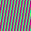
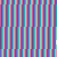

# Tiny Code Christmas 2023 (fc64js-tcc2023)

[Tiny Code Christmas 2023](https://tcc.lovebyte.party/) solutions implemented as roms for my [fc64js](https://github.com/TheInvader360/fc64js) fantasy console

Because: dogfooding :sunglasses:

## Day 1

[readable](https://theinvader360.github.io/fc64js-tcc2023/roms/01/readable/) | [sizecoding](https://theinvader360.github.io/fc64js-tcc2023/roms/01/sizecoding/) (247/256 bytes)

## Day 2

[readable](https://theinvader360.github.io/fc64js-tcc2023/roms/02/readable/) | [sizecoding](https://theinvader360.github.io/fc64js-tcc2023/roms/02/sizecoding/) (215/256 bytes)

## Day 3

[readable](https://theinvader360.github.io/fc64js-tcc2023/roms/03/readable/) | [sizecoding](https://theinvader360.github.io/fc64js-tcc2023/roms/03/sizecoding/) (96/128 bytes)

## Day 4

[readable](https://theinvader360.github.io/fc64js-tcc2023/roms/04/readable/) | [sizecoding](https://theinvader360.github.io/fc64js-tcc2023/roms/04/sizecoding/) (121/128 bytes)

## Day 5

[readable](https://theinvader360.github.io/fc64js-tcc2023/roms/05/readable/) | [sizecoding](https://theinvader360.github.io/fc64js-tcc2023/roms/05/sizecoding/) (157/256 bytes)

## Day 6

[readable](https://theinvader360.github.io/fc64js-tcc2023/roms/06/readable/) | [sizecoding](https://theinvader360.github.io/fc64js-tcc2023/roms/06/sizecoding/) (251/256 bytes)

## Day 7

[readable](https://theinvader360.github.io/fc64js-tcc2023/roms/07/readable/) | [sizecoding](https://theinvader360.github.io/fc64js-tcc2023/roms/07/sizecoding/) (249/256 bytes)

## Day 8

[readable](https://theinvader360.github.io/fc64js-tcc2023/roms/08/readable/) | [sizecoding](https://theinvader360.github.io/fc64js-tcc2023/roms/08/sizecoding/) (188/256 bytes)

## Day 9

[readable](https://theinvader360.github.io/fc64js-tcc2023/roms/09/readable/) | [sizecoding](https://theinvader360.github.io/fc64js-tcc2023/roms/09/sizecoding/) (182/256 bytes)

## Day 10

[readable](https://theinvader360.github.io/fc64js-tcc2023/roms/10/readable/) | [sizecoding](https://theinvader360.github.io/fc64js-tcc2023/roms/10/sizecoding/) (440/--- bytes)

## Day 11

[readable](https://theinvader360.github.io/fc64js-tcc2023/roms/11/readable/) | [sizecoding](https://theinvader360.github.io/fc64js-tcc2023/roms/11/sizecoding/) (517/--- bytes)

## Day 12

[readable](https://theinvader360.github.io/fc64js-tcc2023/roms/12/readable/) | [sizecoding](https://theinvader360.github.io/fc64js-tcc2023/roms/12/sizecoding/) (579/--- bytes)
